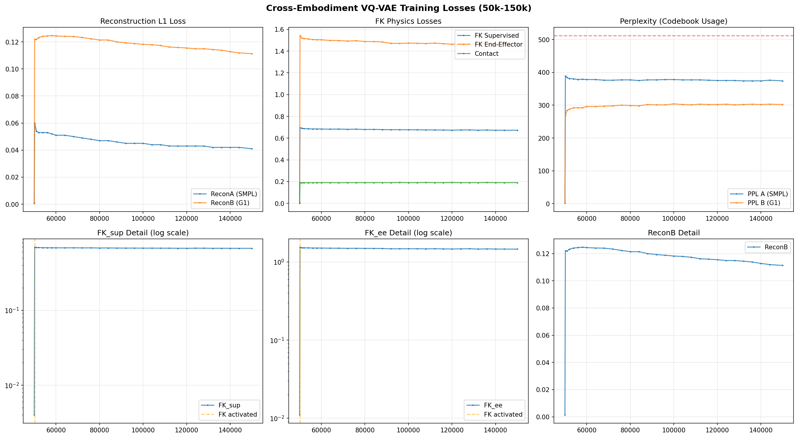

# 跨本体VQ-VAE训练分析报告 — exp_v3_363fk_cut (150k iter)
**日期**: 2026-05-29 | **数据**: SMPL(134D) ↔ G1(363D RIC) | **Codebook**: 512

---

## 1. 实验设置回顾

| 阶段 | 迭代区间 | 激活损失 |
|------|----------|----------|
| Phase 1 | 0 - 5k | 纯L1重建 |
| Phase 2 | 5k - 10k | + Cycle + CUT对比 |
| Phase 3 | 10k+ | + FK物理损失 (fk_sup=0.8, fk_ee=1.5, contact=0.3) |

从50k checkpoint恢复训练，当前到150k。

---

## 2. 最终评估结果 (150k checkpoint)

```
Feature MSE:    0.2516
3D MPJPE (m):   0.3625     ⚠️ 36.25cm
Foot Skating:   0.0409
Jerk:           0.0420
PPL A/B:        374 / 302  (Codebook 512, 未崩塌)
```

---

## 3. Loss曲线分析

### 3.1 重建损失 (ReconB)
- 50k激活FK后 ReconB 从 0.001 跳到 0.122，符合预期（FK loss 与 L1 竞争）
- **100k iter 内仅从 0.122 降到 0.111**（↓9%），收敛极度缓慢
- ReconA (SMPL) 表现正常，从 0.060 → 0.041，持续下降

### 3.2 FK物理损失 — 核心问题
- **FK_sup**: 0.696 → 0.672，100k iter 仅改善 3.4%
- **FK_ee**: 1.543 → 1.458，改善 5.5%
- **Contact**: 0.190 → 0.190，**完全未下降**

FK损失呈现"激活后立刻饱和"的模式——在 50.2k 一跳到位后就几乎不再下降，说明：
1. FK损失的梯度信号可能被L1重建主导淹没
2. 或者6D旋转表示的FK映射存在病态条件，梯度难以传导

### 3.3 Perplexity
- PPL A 从 389 → 374，PPL B 从 269 → 302
- 均远低于512，说明Codebook在有效使用
- 无崩塌风险 ✓

---

## 4. 问题诊断

### 🔴 核心问题：36cm MPJPE — 空间位置几乎未学到

**根因分析**：

| 原因 | 解释 |
|------|------|
| **6D旋转非正交** | 30个关节的6D rotation逐级FK累积，每关节微小误差在末端放大到几十cm。这是HumanML3D类数据的老问题 |
| **FK loss与L1冲突** | 363维特征中rot_data占180维，FK loss只监督关节位置，L1监督所有维度——两个目标在rot子空间上不一致 |
| **RIC与rot的矛盾** | 363维同时包含RIC位置和6D旋转，decoder需要输出两者自洽，但6D旋转的非正交性导致RIC和rot无法同时满足FK一致性 |
| **FK权重不足** | 当前 fk_sup=0.8, fk_ee=1.5，但ReconB=0.11意味着L1每维贡献 ~0.11/363≈3e-4，FK每关节贡献 ~0.67/29≈0.023，FK的梯度信号在数值上比L1大约2个数量级——但FK只通过rot子空间(180维)反向传播，梯度路径极长 |

### 🟡 次要问题

- **Contact完全不收敛**：脚部接触损失卡在0.19，与接触label的信号太稀疏有关（只有2个contact joint）
- **Cycle loss偏高**：CycA=0.050, CycB=0.121，说明B→A→B的重建不如A→B→A，G1信息的编码质量不够
- **Feature MSE 0.25偏高**：虽然编码空间有一定语义，但363维的高维空间重建仍有较大残差

---

## 5. 解决方案对比

### 方案A：6D旋转 → 四元数 (推荐优先级 ⭐⭐⭐)

| 维度 | 说明 |
|------|------|
| 原理 | rot_data从30×6=180维 → 30×4=120维，四元数自带单位模长约束，FK计算天然稳定 |
| 影响 | 总维度363→303，需改动数据预处理、decoder输出head、FK loss |
| 优点 | 从根本上解决FK误差累积问题，学术界标准做法 |
| 缺点 | 需重新训练（可用50k纯重建checkpoint迁移encoder） |
| 预期MPJPE | < 10cm |

### 方案B：两阶段训练——先L1后FK (推荐优先级 ⭐⭐)

| 维度 | 说明 |
|------|------|
| 原理 | 先关闭FK loss纯训L1到收敛（如再训50k），再逐渐加入FK loss |
| 优点 | 改动最小，可复用当前checkpoint |
| 缺点 | 治标不治本，FK loss激活后可能仍然卡住 |
| 预期MPJPE | 不确定，可能改善到20-30cm |

### 方案C：增大FK权重 + 降低L1权重 (推荐优先级 ⭐)

| 维度 | 说明 |
|------|------|
| 原理 | 将fk_sup从0.8提到3.0，fk_ee从1.5提到5.0，并降低reconB权重 |
| 优点 | 一行代码改动 |
| 缺点 | 可能导致重建质量崩塌，PPL下降 |
| 预期MPJPE | 大概率仍然 > 20cm |

### 方案D：正交正则化 (推荐优先级 ⭐⭐)

| 维度 | 说明 |
|------|------|
| 原理 | 在现有6D rotation上加正交正则化 loss: ||R^T R - I|| |
| 优点 | 不改数据格式，不改网络结构 |
| 缺点 | 额外计算开销，可能只部分缓解 |
| 预期MPJPE | 可能改善到20-30cm |

### 方案E：改成纯位置编码 + IK逆解 (推荐优先级 ⭐)

| 维度 | 说明 |
|------|------|
| 原理 | decoder输出关节3D位置 + 用IK回解旋转，避免直接预测旋转 |
| 优点 | FK不再有累积误差 |
| 缺点 | IK本身是非凸优化，可能引入新噪声 |
| 预期MPJPE | 取决于IK质量 |

---

## 6. 推荐行动计划

| 优先级 | 行动 | 时间估计 |
|--------|------|----------|
| **立即** | 运行方案D（正交正则化）在当前checkpoint上续训50k iter快速验证 | 半天 |
| **短期** | 启动方案A（四元数）的数据预处理改造 + 新训练 | 2-3天 |
| **中期** | 四元数版本训好后跑完整MaskGIT对比 | 1周 |
| **论文** | 消融实验：6D vs Quat, with/without FK, with/without CUT | - |

---

## 7. 可视化对比



从曲线上可以清楚看到：
- FK losses (左下两图) 在50.2k激活后立刻饱和，之后100k iter几乎水平
- ReconB (右下) 下降极慢
- PPL健康，Codebook没有崩塌

---

**结论**: 当前模型在特征编码层面有效（PPL健康，Feature MSE合理），但在空间位置精度上严重不足（36cm MPJPE）。根本原因大概率是**6D旋转表示的FK误差累积**。建议优先尝试四元数方案。
